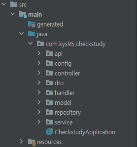
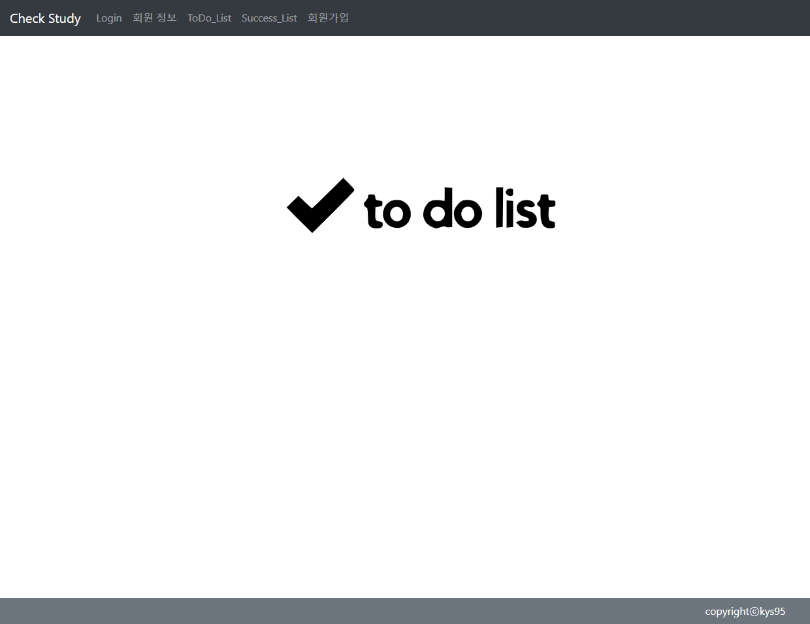
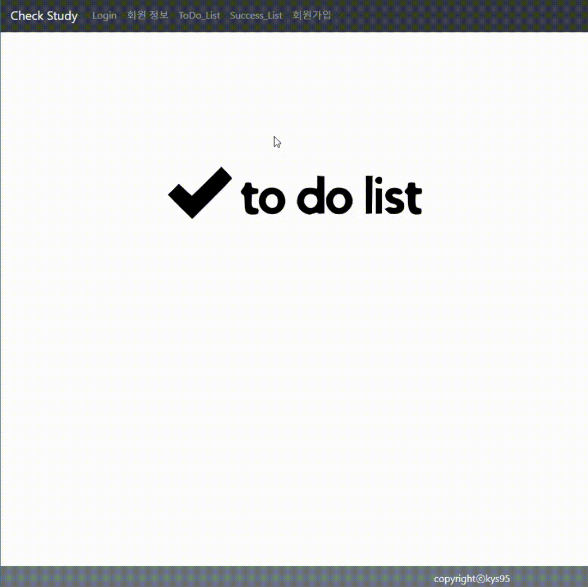
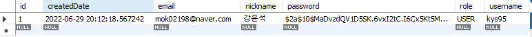
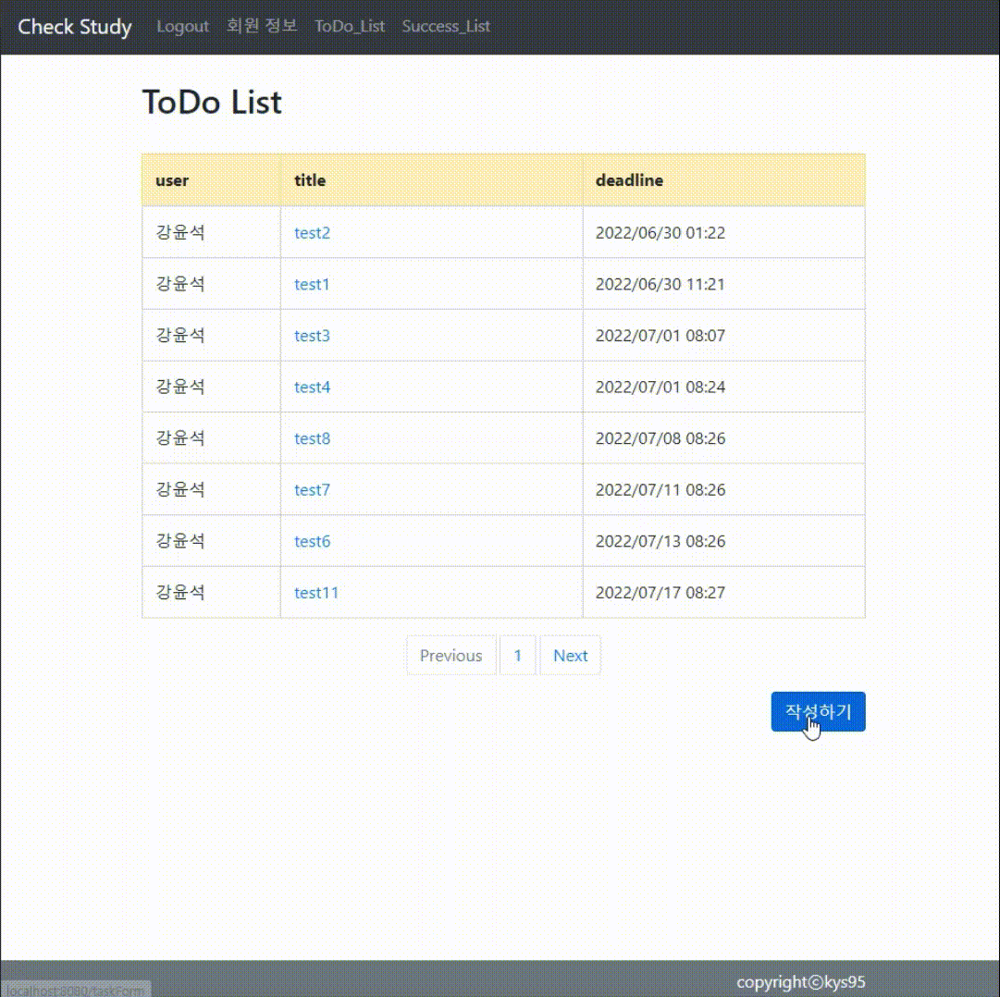
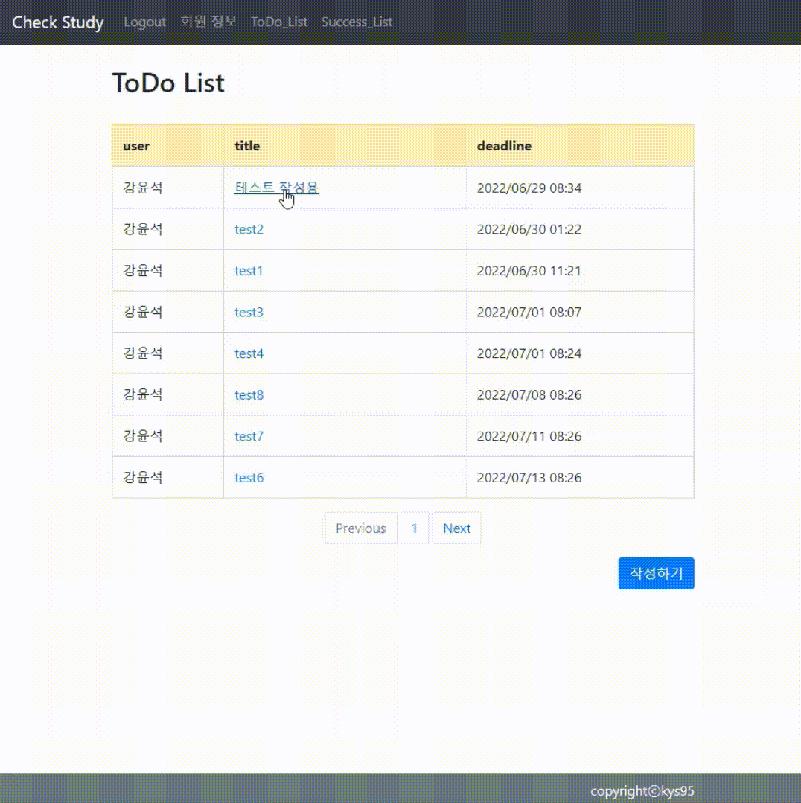
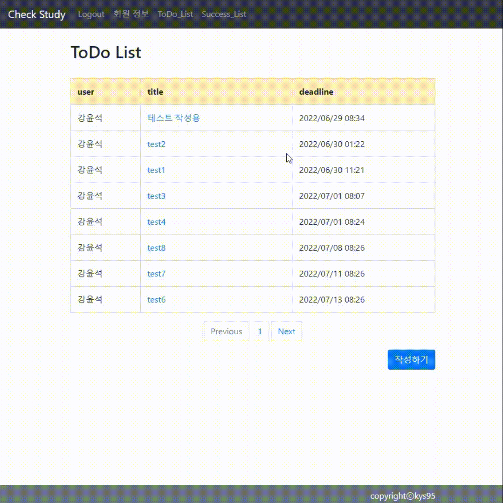

# Check-Study
## Spring Boot(Gradle), JPA(MySQL), Jquery
### Todo List Web Project
- - -

## 프로젝트 구성

- - -

## Index Page

- - -

## 회원가입 & 로그인
### 스프링 시큐리티 + BCryptPasswordEncoder

### DB(암호화 해시 함수)

- - -

## Task(게시글) 작성 & Deadline(마감일)기준 정렬

- - -

## Success List 변경
> Todo List가 완료되면 Success List로 이동

- - -

## Feedback(댓글) 작성 & 삭제

- - -

## Task 수정 & 삭제

